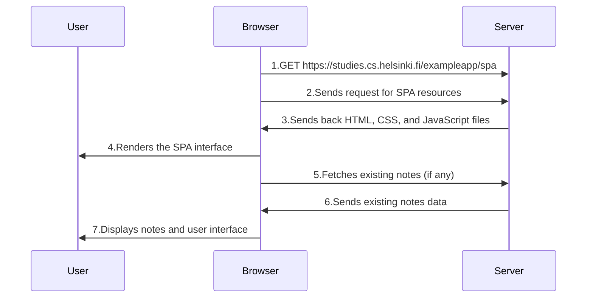

```mermaid
sequenceDiagram
    participant User
    participant Browser
    participant Server

    Browser->>Server: 1.GET https://studies.cs.helsinki.fi/exampleapp/spa
    Browser->>Server: 2.Sends request for SPA resources
    Server->>Browser: 3.Sends back HTML, CSS, and JavaScript files
    Browser->>User: 4.Renders the SPA interface
    Browser->>Server: 5.Fetches existing notes (if any)
    Server->>Browser: 6.Sends existing notes data
    Browser->>User: 7.Displays notes and user interface
```