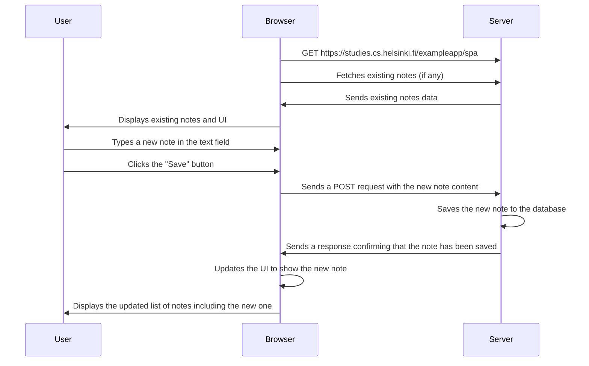

```mermaid
sequenceDiagram
    participant User
    participant Browser
    participant Server

    Browser->>Server: GET https://studies.cs.helsinki.fi/exampleapp/spa
    Browser->>Server: Fetches existing notes (if any)
    Server->>Browser: Sends existing notes data
    Browser->>User: Displays existing notes and UI

    User->>Browser: Types a new note in the text field
    User->>Browser: Clicks the "Save" button
    Browser->>Server: Sends a POST request with the new note content
    Server->>Server: Saves the new note to the database
    Server->>Browser: Sends a response confirming that the note has been saved
    Browser->>Browser: Updates the UI to show the new note
    Browser->>User: Displays the updated list of notes including the new one
```